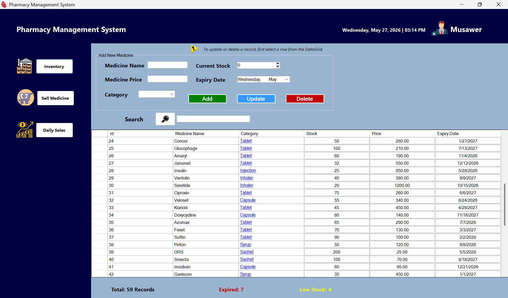
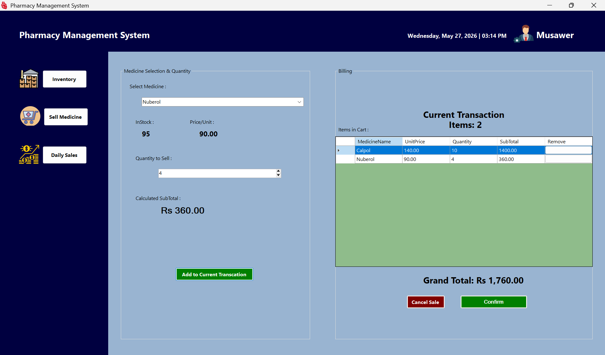
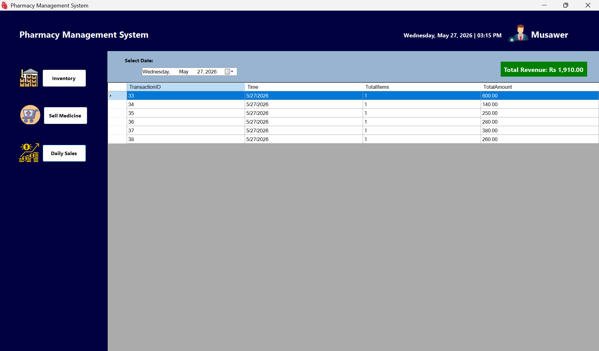

# 💊 Pharmacy Management System


> A desktop application to manage pharmacy operations — inventory, medicine sales, billing, and daily revenue tracking — built with C#, WinForms, and Microsoft SQL Server.

---

## 📋 Table of Contents

- [💊 Pharmacy Management System](#-pharmacy-management-system)
  - [📋 Table of Contents](#-table-of-contents)
  - [📌 About](#-about)
  - [✨ Features](#-features)
  - [🛠️ Tech Stack](#️-tech-stack)
  - [💻 System Requirements](#-system-requirements)
  - [📦 Installation \& Setup](#-installation--setup)
  - [🗄️ Database Overview](#️-database-overview)
  - [📸 Screenshots](#-screenshots)
    - [Inventory Management](#inventory-management)
    - [Sell Medicine — Point of Sale](#sell-medicine--point-of-sale)
    - [Daily Sales Dashboard](#daily-sales-dashboard)
  - [📁 Folder Structure](#-folder-structure)
  - [🚀 Future Enhancements](#-future-enhancements)
  - [🐛 Common Errors \& Fixes](#-common-errors--fixes)
  - [👨‍💻 Author](#-author)
  - [📄 License](#-license)

---

## 📌 About

Managing a pharmacy manually is slow and error-prone. This system automates the core operations — stock management, point-of-sale billing, and sales reporting — in a clean Windows desktop interface.

Built as a **BSCS 4th Semester Final Project** to demonstrate real-world C# and SQL Server development.

---

## ✨ Features

**Inventory Management**
- Add, update, delete, and search medicines
- Track stock quantity, price, category, and expiry date
- Status bar shows: Total Records | Expired Count | Low Stock Count

**Sell Medicine (POS)**
- Select medicine from dropdown — stock and price auto-fill
- Add multiple items to a cart with live subtotal calculation
- Confirm sale: updates stock and saves transaction to database
- Cancel to discard without changes

**Daily Sales Dashboard**
- Filter transactions by date
- View Transaction ID, Date, Total Items, and Amount
- Total Revenue displayed in a prominent green badge

---

## 🛠️ Tech Stack

| Technology               | Purpose                   |
| ------------------------ | ------------------------- |
| C# / .NET Framework      | Core language and runtime |
| Windows Forms (WinForms) | Desktop UI                |
| Microsoft SQL Server     | Database                  |
| ADO.NET                  | Database connectivity     |
| Visual Studio 2019/2022  | IDE                       |

---

## 💻 System Requirements

- Windows 10 / 11
- .NET Framework 4.7.2+
- Microsoft SQL Server 2019 or 2022
- SQL Server Management Studio (SSMS)
- Visual Studio 2019 or 2022

---

## 📦 Installation & Setup

**1. Clone the repository**
```bash
git clone https://github.com/musawerxd/Pharmacy-Management-System-C-.git
```

**2. Open in Visual Studio**

Open the `.sln` file in Visual Studio 2019 or 2022.

**3. Update the connection string**

In `App.config`, update the connection string to match your SQL Server instance:
```xml
<connectionStrings>
  <add name="PharmacyDB"
       connectionString="Server=YOUR_SERVER_NAME;Database=PharmacyDB;Integrated Security=True;"
       providerName="System.Data.SqlClient" />
</connectionStrings>
```

> Replace `YOUR_SERVER_NAME` with your instance name, e.g. `localhost`, `.\SQLEXPRESS`, or `(local)`.

**4. Run the project**

Press `F5` or click the Start button in Visual Studio.

---

## 🗄️ Database Overview

The project uses a **Microsoft SQL Server** database named `PharmacyDB` with 3 tables:

| Table       | Description                                                                  |
| ----------- | ---------------------------------------------------------------------------- |
| `Medicines` | Stores medicine records — name, category, quantity, price, and expiry date   |
| `Sales`     | Records each sale — medicine name, quantity sold, total price, and sale date |
| `Users`     | Stores login credentials for system access                                   |

The database comes pre-loaded with **50 medicines** across categories including Tablets, Capsules, Syrups, Injections, Inhalers, and more.

> The full SQL setup script (create tables + sample data) is included in the repository at `Query/PharmacySQL.txt`. Open it in SSMS and run it to get started.

---

## 📸 Screenshots

### Inventory Management


### Sell Medicine — Point of Sale


### Daily Sales Dashboard


> Create an `images/` folder at the repo root and save your screenshots as `inventory.png`, `sell-medicine.png`, and `daily-sales.png`.

---

## 📁 Folder Structure

The project uses a **single Form** (`Form1.cs`) with a fixed three-panel layout — top header, left sidebar, and a right main panel that swaps between three UserControls based on navigation.

```
Pharmacy-Management-System-C-/
├── Form1.cs                          # Main window — header, sidebar, content panel
├── Form1.Designer.cs
├── Program.cs                        # Application entry point
├── DatabaseHelper.cs                 # All SQL Server queries and connections
├── UC_Inventory.cs                   # UserControl — Inventory management
├── UC_Inventory.Designer.cs
├── UC_Sell.cs                        # UserControl — Sell Medicine / POS
├── UC_Sell.Designer.cs
├── UC_DailySales.cs                  # UserControl — Daily Sales dashboard
├── UC_DailySales.Designer.cs
├── App.config                        # Connection string
├── app.manifest
├── Pharmacy-Management-System.csproj
└── Properties/
```

---

## 🚀 Future Enhancements

- Login system with Admin / Cashier roles
- Print receipt after each sale
- Monthly and yearly sales reports with charts
- Low-stock and expiry email alerts
- Export sales data to Excel or PDF
- Transaction drill-down to view item-level details

---

## 🐛 Common Errors & Fixes

**`Cannot connect to SQL Server`**
— Start the SQL Server service via `services.msc` and verify your server name in `App.config`.

**`Cannot open database "PharmacyDB"`**
— Open SSMS and run `database.sql` from the repository to create the database and tables.

**`Invalid object name 'Medicines'`**
— The tables haven't been created yet. Run `database.sql` in SSMS first.

**Project won't build**
— Right-click the solution → Restore NuGet Packages. Verify the target .NET Framework version matches your machine.

---

## 👨‍💻 Author

- **Musawer** — [@musawerxd](https://github.com/musawerxd)


---

## 📄 License

This project is licensed under the [MIT License](LICENSE).

---

*⭐ If this project helped you, consider giving it a star on GitHub!*
